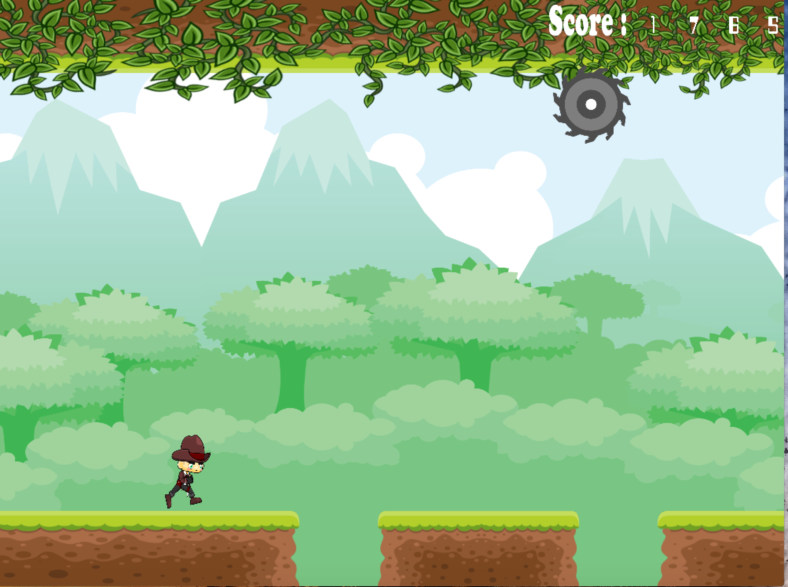
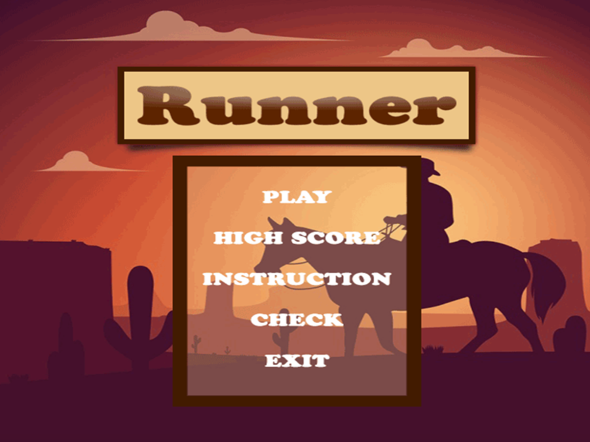
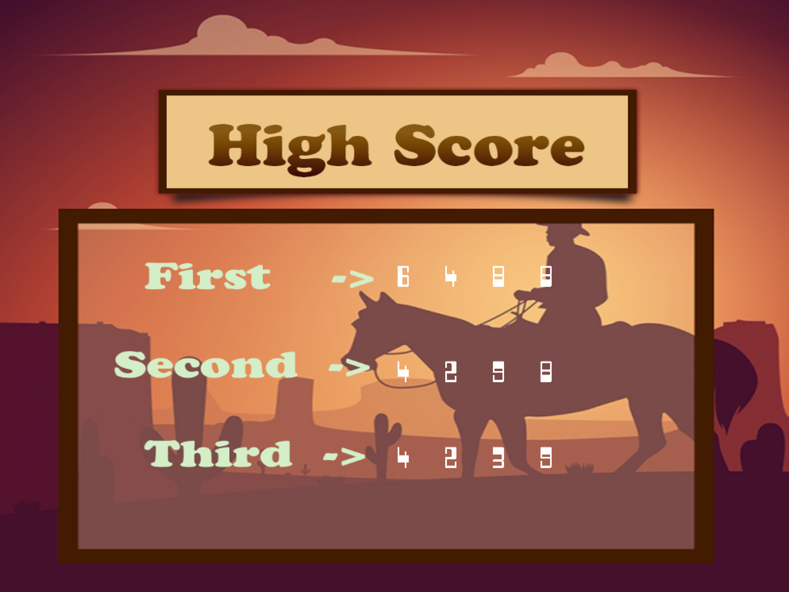
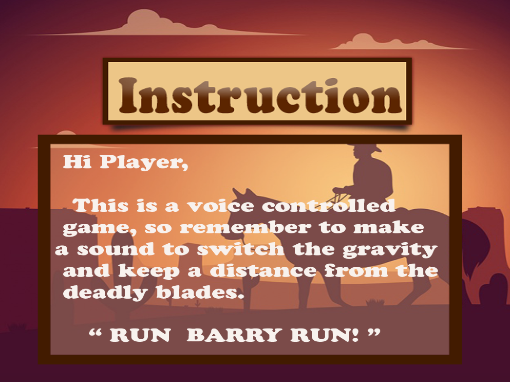
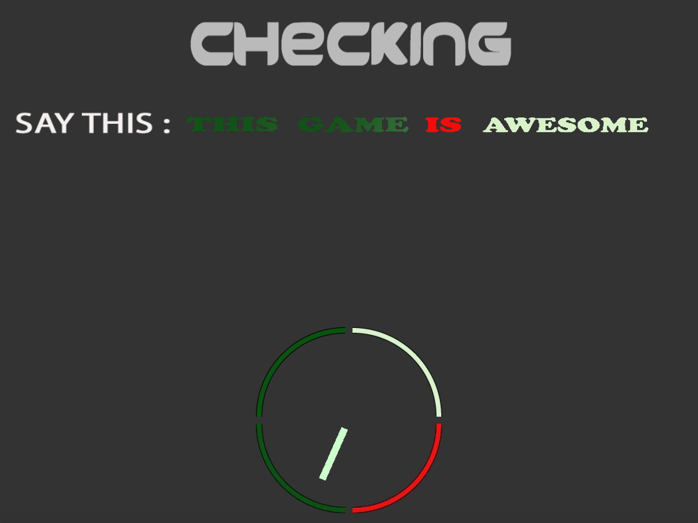
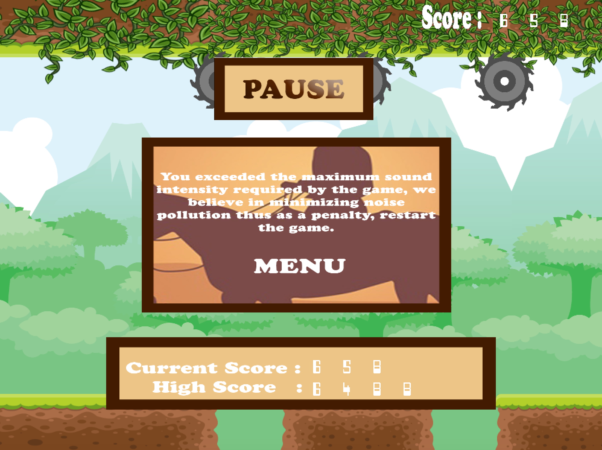

# Infinity Runner

## Description
**Infinity Runner** is a voice-controlled game developed in JAVA [2018]. The user controls the game's gravity, meaning the user can shift the gravity upside down and vice versa. There are obstacles (rotating blades on the ceiling and deep pits in the ground), which the player must avoid. It is an infinite playground where the player wins by beating the high score. The game takes inputs in two forms:

- Content of the speech
- The intensity of the sound

## Demo
[](https://youtu.be/qsZ70w5Xtrc)

## Game Screens, Control and Libraries
The game features four screens:
- Play screen - where the user plays the game
- High score - To view the top three high scores
- Instructions - To see how to play the game
- Check - To verify if microphone and speech to text are working

The game runs on multiple threads to process speech and render the game smoothly. There are three threads:
1. First thread to render the game screen
2. Second thread to capture the speech and convert it to text
3. Third thread to record the sound intensity

Infinity Runner uses an OpenGL based gaming engine library ([LWJGL](https://github.com/LWJGL/lwjgl3)) for rendering the screen. [CMU Sphinx](https://cmusphinx.github.io/) is used as a speech recognition engine for higher grammar control.

## Run the Game
To run the game follow these steps-
1. Clone the git repository
```
git clone https://github.com/rishabh-rustogi/Infinity-Runner.git
```
2. Inside the local repository, go to distribution folder
```
cd distribution
```
3. To run the code on your system, run
```
# For linux users
java -Djava.library.path=lwjgl_native/linux -jar Infinity_Runner.jar

# For mac users
java -Djava.library.path=lwjgl_native/macosx -jar Infinity_Runner.jar

# For windows users
java -Djava.library.path=lwjgl_native/windows -jar Infinity_Runner.jar

# For any other system <system>
java -Djava.library.path=lwjgl_native/<system> -jar Infinity_Runner.jar
```
  
## Screenshots
       
       
       
  
## Contributors

- Rishabh Rustogi
- Ayush Prasad 
